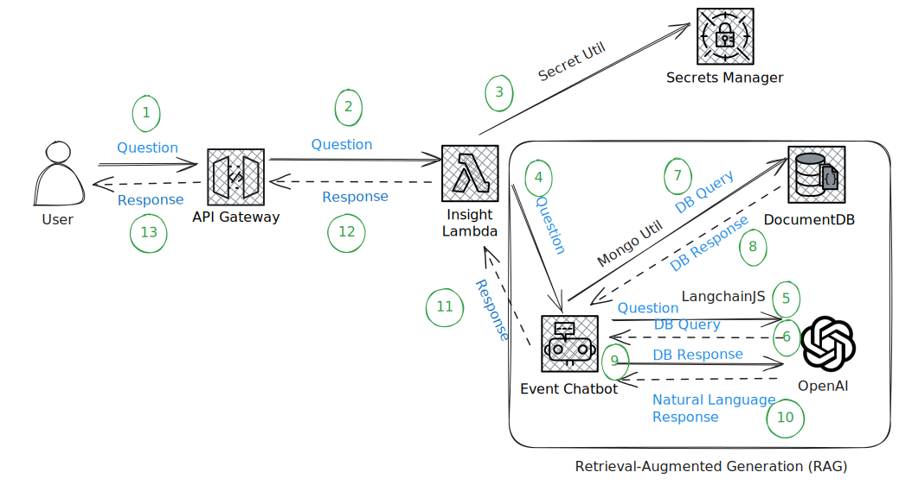

Simple AWS ChatGPT
============================
**Simple AWS ChatGPT** is a project that demonstrates the integration of ChatGPT with AWS Lambda and API Gateway. 
It provides a serverless architecture for deploying a chatbot using AWS services.

The primary goal of the ChatBot is to generate a DocumentDB query from user input and return the response 
in natural language.



### Key Features
  - **Chatbot Integration**: Utilizes OpenAI's GPT-3 model for generating responses to user queries. It takes 
    advantage of the `LangchainJs` library to interact with the OpenAI API.
  - **Serverless Architecture**: Utilizes AWS Lambda for running the chatbot logic and API Gateway for handling HTTP requests.
  - **Environment Configuration**: Requires setting up specific environment variables for AWS credentials and region.
  - **Infrastructure as Code**: Uses Terraform for provisioning and managing AWS infrastructure.

### Chatbot Logic
The chatbot logic in this project is implemented using AWS Lambda and integrates with Azure OpenAI services. 
Here is a brief overview of the key components and their roles:

  1. **Event Handling**: The Lambda function serves as the entry point for handling incoming events from API Gateway. 
    It processes the event and context objects, logs the information, and initializes the chatbot if it hasn't 
    been initialized yet.

  2. **Secret Management**: The `SecretUtil` class is used to retrieve sensitive information such as database 
    credentials and OpenAI API secrets from a secure storage (e.g., AWS Secrets Manager).

  3. **Database Connection**: The `MongoUtil` class manages the connection to a MongoDB database 
  using the retrieved credentials. It ensures that the database connection is established before 
  processing any chatbot queries.

  4. **Chatbot Initialization**: The `EventChatbot` class is initialized with the necessary Azure OpenAI 
  credentials and the MongoDB utility instance. This class handles the interaction with the OpenAI API to 
  generate responses to user queries.

  5. **Question Handling**: When a user query is received, the chatbot processes the question 
  using the `answerQuestion` method of the `EventChatbot` class. The response is then returned to the user.

Here is a simplified flow of the chatbot logic:

  1. **Receive Event**: The Lambda function receives an event from API Gateway.
  2. **Log Event**: The event and context are logged for debugging purposes.
  3. **Initialize Chatbot**: If the chatbot is not already initialized, retrieve secrets, connect to the database, 
     and initialize the `EventChatbot`.
  4. **Process Query**: Parse the user query from the event payload and use the `EventChatbot` to generate a response.
  5. **Return Response**: Send the generated response back to the user via API Gateway.

This architecture ensures a scalable and secure implementation of the chatbot using serverless technologies 
and managed services.

## Build
  1. **Clone Repository**: Clone the repository to your local machine.
  2. **Install Dependencies**: Install the required JavaScript dependencies by executing `yarn isntall` from the 
     `code` directory.
  3. **Build Distribution**: Execute the following command `yarn dist:insight`.

## Deployment
  1. **Prerequisites**: 
    - Ensure that you have the necessary AWS credentials and permissions to deploy the infrastructure.
    - Create the `dev.tfvars` file in the `infra/environments/us-west-2` directory with the required variables.
```javascript
env                   = "dev"
moniker               = "36GE0085-C-UW2"
vpc_id                = REPLACE_ME_WITH_AWS_ACCT_VPC
log_level             = "DEBUG"
servicealias          = "simpleinsight"
serviceid             = "36GE0085"

dev_db_host=REPLACE_ME_WITH_DOCUMENT_DB_HOST
dev_db_port=REPLACE_ME_WITH_DOCUMENT_DB_PORT
dev_db_user_name=REPLACE_ME_WITH_DOCUMENT_DB_USER
dev_db_pwd=REPLACE_ME_WITH_DOCUMENT_DB_PASSWORD
dev_db_query_string=REPLACE_ME_WITH_DOCUMENT_DB_QUERY_STRING
dev_db_cert="global-bundle.pem"
dev_db_name=REPLACE_ME_WITH_DOCUMENT_DB_NAME
dev_db_collection_event=REPLACE_ME_WITH_DOCUMENT_DB_COLLECTION

azure_openai_api_instance_name=REPLACE_ME_WITH_AZURE_OPEN_AI_INSTANCE_NAME
azure_openai_api_deployment_name=REPLACE_ME_WITH_AZURE_OPEN_AI_MODEL_NAME
azure_openai_api_version=REPLACE_ME_WITH_AZURE_OPEN_AI_API_VERSION

azure_authority_host=REPLACE_ME_WITH_AZURE_AUTHORITY_HOST
azure_tenant_id=REPLACE_ME_WITH_AZURE_TENANT_ID
azure_client_id=REPLACE_ME_WITH_AZURE_CLIENT_ID
azure_client_secret=REPLACE_ME_WITH_AZURE_CLIENT_SECRET
```
  2. **Configure Environment Variables**: Set up the necessary environment variables for AWS credentials and region 
     in the project home directory.
     The following AWS environment variables are expected:
     ```bash
     export AWS_ACCESS_KEY_IDd="<AWS_ACCESS_KEY_ID>"
     export AWS_SECRET_ACCESS_KEY="<AWS_SECRET_ACCESS_KEY>"
     export AWS_SESSION_TOKEN="<AWS_SESSION_TOKEN>"
     export AWS_DEFAULT_REGION="<AWS_DEFAULT_REGION>"
 3.**Deploy Infrastructure**: Create the necessary AWS resources by executing the `setup.sh deploy` script from the 
      project home directory.

 
